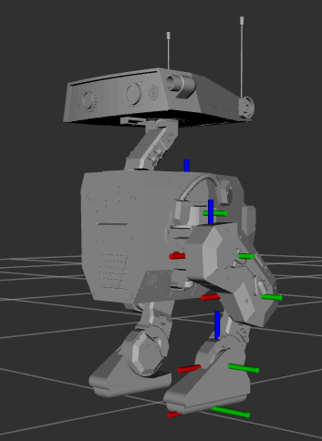
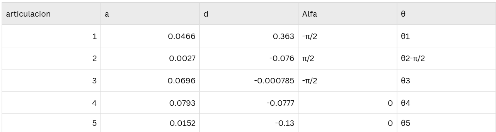

# Análisis cinemático: Tabla de Denavit-Hartenberg
En la siguiente seccion se realizara el analisis de la pierna izquierda del robot AWD bipode

Pasos:

1. Obtuvimos de rviz los ejes de nuestro robot para vizualizar como estan orientados.

    

    Foto 1. Ejes de nuestro robot bipoide

    En Gazebo el eje rojo es X, el eje verde es Y, y el eje azul es Z.

2. Basado en el URDF pudimos obtener que la cadena cinematica del robot:

    S0 (Pelvis)

    |

    Z0

    |

    S1 (hip_yaw) → X1 gira con θ1

    |

    Z1 (↓)

    |

    S2 (hip_roll) → X2 (↓)

    |

    Z2 (→)

    |

    S3 (hip_pitch) → X3 (→)

    |

    Z3 (←)

    |

    S4 (knee) → X4 (↓)

    |

    Z4 (←)

    |
    
    S5 (ankle)

3. Despues de analizar los marcos obtuvimos la siguiente tabla de Denavit-Hatenberg:

    

    El procedimiento que se realizo para llegar a esto estuvo basado en el URDF:

    Parra determinar las Z se colocaron en la direccion de rotacion de cada articulacion.
    Con los parametros a y d se tomaron los valores de origin del urdf segun el eje que correspondiera. 

     a. left-hip-yaw

     z1 apunta hacia abajo. d es la distancia vertical desde el pelvis hasta la ariculacion. a es el desplazamiento laateral en Y. Como el eje Z1 es perpendicular al Z0 del pelvis, el ángulo twist α es -90° (o -π/2 radianes). La variable θ1 representa el ángulo de rotación de la articulación.

     b. Left_hip_roll

    El eje Z2 sigue la dirección del movimiento de "roll". La d 0.076 m es la distancia en Z desde la articulación anterior. El parámetro a es pequeño, ya que hay poco desplazamiento en X. El ángulo α es +90° porque Z2  es perpendicular a Z1. El ángulo θ2 se ajusta con -π/2 para alinear los marcos correctamente.

    c. Left_hip_pitch

    Esta articulación gira en "pitch" (eje lateral izquierdo, Z3). d es casi cero porque el centro de rotación está alineado. a es la distancia hacia adelante desde la articulación de roll. El ángulo α es -90° porque Z3 es perpendicular a Z2. La variable θ3 controla el movimiento de la cadera.

    d. Left_knee

    El eje Z4 es paralelo al Z2 de la cadera, por lo que α es 0°. d es la distancia vertical desde la cadera hasta la rodilla. El parámetro a 0.079306 m es la distancia horizontal hacia adelante. El ángulo θ4 determina la flexión de la rodilla.

    e. left_ankle
    El eje Z5 apunta opuesto a Z1. d -0.13 m es la distancia desde la rodilla al tobillo. El parámetro a 0.0152 m es el pequeño desplazamiento en Y. Como Z5 es paralelo a Z3, α es 0°. El ángulo θ5 controla la inclinación del pie.

# Visualización de la posición del efector final en RViz

# Simulación en Gazebo con controladores

# Generación heurística de una sentadilla
