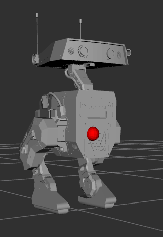

# Análisis cinemático: Tabla de Denavit-Hartenberg
En la siguiente seccion se realizara el analisis de la pierna izquierda del robot AWD bipode

Pasos:

1. Obtuvimos de rviz los ejes de nuestro robot para vizualizar como estan orientados.

    

    Foto 1. Ejes de nuestro robot bipoide

    En Gazebo el eje rojo es X, el eje verde es Y, y el eje azul es Z.

2. Basado en el URDF pudimos obtener que la cadena cinematica del robot:

    S0 (Pelvis)

    |

    Z0

    |

    S1 (hip_yaw) → X1 gira con θ1

    |

    Z1 (↓)

    |

    S2 (hip_roll) → X2 (↓)

    |

    Z2 (→)

    |

    S3 (hip_pitch) → X3 (→)

    |

    Z3 (←)

    |

    S4 (knee) → X4 (↓)

    |

    Z4 (←)

    |
    
    S5 (ankle)

3. Despues de analizar los marcos obtuvimos la siguiente tabla de Denavit-Hatenberg:

    

    El procedimiento que se realizo para llegar a esto estuvo basado en el URDF:

    Parra determinar las Z se colocaron en la direccion de rotacion de cada articulacion.
    Con los parametros a y d se tomaron los valores de origin del urdf segun el eje que correspondiera. 

     a. left-hip-yaw

     z1 apunta hacia abajo. d es la distancia vertical desde el pelvis hasta la ariculacion. a es el desplazamiento laateral en Y. Como el eje Z1 es perpendicular al Z0 del pelvis, el ángulo twist α es -90° (o -π/2 radianes). La variable θ1 representa el ángulo de rotación de la articulación.

     b. Left_hip_roll

    El eje Z2 sigue la dirección del movimiento de "roll". La d 0.076 m es la distancia en Z desde la articulación anterior. El parámetro a es pequeño, ya que hay poco desplazamiento en X. El ángulo α es +90° porque Z2  es perpendicular a Z1. El ángulo θ2 se ajusta con -π/2 para alinear los marcos correctamente.

    c. Left_hip_pitch

    Esta articulación gira en "pitch" (eje lateral izquierdo, Z3). d es casi cero porque el centro de rotación está alineado. a es la distancia hacia adelante desde la articulación de roll. El ángulo α es -90° porque Z3 es perpendicular a Z2. La variable θ3 controla el movimiento de la cadera.

    d. Left_knee

    El eje Z4 es paralelo al Z2 de la cadera, por lo que α es 0°. d es la distancia vertical desde la cadera hasta la rodilla. El parámetro a 0.079306 m es la distancia horizontal hacia adelante. El ángulo θ4 determina la flexión de la rodilla.

    e. left_ankle
    El eje Z5 apunta opuesto a Z1. d -0.13 m es la distancia desde la rodilla al tobillo. El parámetro a 0.0152 m es el pequeño desplazamiento en Y. Como Z5 es paralelo a Z3, α es 0°. El ángulo θ5 controla la inclinación del pie.

# Visualización de la posición del efector final en RViz

Se calculo la posicion de la pelvis respecto al pie Izquierdo usando una cadena de transformaciones de Denavit-Hartenberg (DH).

Se extanjeron los parametros de las articulaciones desde el URDF, en el orden: left_ankle → left_knee → left_hip_pitch → left_hip_roll → left_hip_yaw → pelvis.

Los parametros fueron organizados en una tabla invertida, ya que el objetivo era la posicion del pelvis respecto al pie.

Para hacer esto de forma fácil se utilizo un nodo en ros2 que escucha el topico joint_state y recorre la tabla DH y multiplica las matrices homogeneas para cada articulacion usando: 

$$
T_i = \begin{bmatrix}
\cos\theta_i & -\sin\theta_i \cos\alpha_i & \sin\theta_i \sin\alpha_i & a_i \cos\theta_i \\
\sin\theta_i & \cos\theta_i \cos\alpha_i & -\cos\theta_i \sin\alpha_i & a_i \sin\theta_i \\
0 & \sin\alpha_i & \cos\alpha_i & d_i \\
0 & 0 & 0 & 1
\end{bmatrix}
$$

Al final, se aplica un vector de offset desde la última articulación (left_hip_yaw) al centro de la pelvis.

Se publica un visualization_msgs/Marker en el frame pelvis con la posición final de la pelvis calculada.

Esta fue la posición obtenida: 

        [INFO] [1750046500.948614672] [pelvis_marker_publisher]: Pelvis (desde pie): x=0.165, y=-0.122, z=0.207
Para confirmar que fuera correcto se uso ros2 run tf2_ros tf2_echo pelvis left_foot_link que arroja la posicion del pie izquierdo respecto a la pelvis como una transformacion TF.

    - Translation: [-0.055, 0.104, 0.081]
    - Rotation: in Quaternion [0.000, -0.006, 0.000, 1.000]
    - Rotation: in RPY (radian) [0.000, -0.013, 0.000]
    - Rotation: in RPY (degree) [0.000, -0.729, 0.000]
    - Matrix:
    1.000 -0.000 -0.013 -0.055
    0.000  1.000 -0.000  0.104
    0.013  0.000  1.000  0.081
    0.000  0.000  0.000  1.000                                                                                                             [INFO] [1750046500.948614672] [pelvis_marker_publisher]: Pelvis (desde pie): x=0.165, y=-0.122, z=0.207

Ambos valores representan transformaciones inversas:

  Da la posición del pie desde la pelvis:  
$$
T_{\text{foot} \to \text{pelvis}}
$$
 
  Da la posición de la pelvis desde el pie:
  
 $$
T_{\text{pelvis} \to \text{foot}}
$$

Ambas transformaciones están relacionadas como matrices inversas:  

$$
T_{\text{foot} \to \text{pelvis}} = T^{-1}_{\text{pelvis} \to \text{foot}}
$$
Si se realizara este procedimiento a mano tendria que construir todas las matrices de DH individuales. Multiplicar las 5 transformadas ya que va desde el pie hasta la pelvis
$$
T_{\text{foot} \to \text{pelvis}} = T_1 \cdot T_2 \cdot T_3 \cdot T_4 \cdot T_5
$$

# Simulación en Gazebo con controladores
Para simular el robot BDX en Gazebo y permitir que reciba comandos de posición mediante controladores, seguí el siguiente procedimiento:

### spawn en gazebo
El robot se spawnea en Gazebo a partir de su modelo URDF usando el nodo spawn_entity.py. Para esto, utilizamos un archivo launch que incluye el robot descrito con xacro y lo publica en el robot_description

    ros2 launch urdf_description gazebo.launch.py

Dentro del archivo gazebo.launch.py, se incluye:

- El plugin gazebo_ros2_control

- El controller_manager

- El robot_state_publisher

Para que funcionara tanto en gazebo como en Rviz tuvimos que implementar las meshes de la siguiente manera: 

    <mesh filename="file://$(find urdf_description)/meshes/pelvis.stl"

### Plugins

Se agrego al urdf el siguiente pluging para que los joints definidos sean controlados por ros2_control.

    <gazebo>
    <plugin name="gazebo_ros_control" filename="libgazebo_ros2_control.so">
        <parameters>$(find urdf_description)/config/controllers.yaml</parameters>
    </plugin>
    </gazebo>

En cada joint que se desea controlar se define el hardware interface.

En ROS 2, dentro de un archivo URDF, las transmissions se utilizan para conectar las joints del modelo con los controladores de ros2_control. Aunque no afectan la visualización ni la física en RViz o Gazebo directamente, son esenciales para habilitar el control de actuadores mediante controladores de hardware o simulación.

En nuestro caso solo queriamos controlar la parte inferior para que el roobot pudiera realizar la sentadilla, asi que pusimos transmissions a las joints inferior mientras que las joints superiores las volvimos staticas, para poder tener mejor control sobre nuestro robot.

En nuestro modelo URDF, se definieron transmisiones para cada articulación con el objetivo de integrarlas correctamente al sistema de control de ROS 2. Cada transmisión incluye un nombre identificador y su tipo, que en nuestro caso fue siempre SimpleTransmission, ya que no contamos con mecanismos complejos como engranajes. A continuación, se especifica el joint del URDF que se desea controlar, indicando también que el tipo de interfaz de control será por posición (position). Esta decisión se tomó porque el dato que queremos enviar al robot para ejecutar sus movimientos es precisamente la posición final de cada articulación. Además, se incluye un actuador virtual que es necesario para que ROS 2 establezca correctamente el vínculo entre el controlador y el joint. Este actuador también se define con la interfaz de position y una relación de reducción mecánica de 1, de forma que el movimiento no se vea afectado por ningún factor de escala.

 A continuación se muestra un ejemplo de una transmisión correspondiente a la articulación left_hip_yaw. Como todas las transmisiones del modelo siguen esta misma estructura, es trivial explicar cada una de manera individual.

    <transmission name="left_hip_yaw_trans">
        <type>transmission_interface/SimpleTransmission</type>
        <joint name="left_hip_yaw">
        <hardwareInterface>position</hardwareInterface>
        </joint>
        <actuator name="left_hip_yaw_motor">
        <hardwareInterface>position</hardwareInterface>
        <mechanicalReduction>1</mechanicalReduction>
        </actuator>
    </transmission>

   

También se define en <ros2_control> los command_interface y state_interface.

El bloque <ros2_control> permite especificar para cada joint qué tipo de comandos puede recibir (command_interface) y qué tipo de información puede reportar (state_interface). Por ejemplo, un command_interface puede ser de tipo position, velocity o effort, dependiendo de si se desea controlar la posición, velocidad o el esfuerzo del joint.

Por otro lado, los state_interface permiten obtener retroalimentación del sistema, como la posición actual del joint, su velocidad o el esfuerzo que está aplicando. Estos elementos aseguran que el controlador sepa cómo comunicarse correctamente con el modelo. 

Se indica que la articulación será controlada por posición mediante la interfaz command_interface, con un rango permitido de movimiento entre -3.14 y 3.14 radianes para que pueda completar un circulo sin limitaciones. Además, se especifican tres state_interface para monitorear su estado en tiempo real: la posición, con un valor inicial de 0 radianes, la velocidad y el esfuerzo.

Solo se define una vez el ros2_control y debajo se configuran los state_interface y command_interface de cada joint. Solo se puso uno de ejemplo ya que todos son iguales y es trivial ponerlos todos. 

    <ros2_control name="robot_controller" type="system">
        <hardware>
        <plugin>gazebo_ros2_control/GazeboSystem</plugin>
        </hardware>

    <!-- Pierna izquierda -->
    <joint name="left_hip_yaw">
      <command_interface name="position">
        <param name="min">-3.14</param>
        <param name="max">3.14</param>
      </command_interface>
      <state_interface name="position">
        <param name="initial_value">0</param>
      </state_interface>
      <state_interface name="velocity"/>
      <state_interface name="effort"/>
    </joint>

### gazebo_ros_control, controller_manager y .yaml
 El primer paso es agregar el plugin gazebo_ros2_control dentro del archivo .xacro. Este plugin permite que los comandos enviados desde ROS2 a través de controladores puedan afectar el comportamiento Gazebo. Se incluye dentro de la etiqueta <gazebo> asociada al link raíz del robot, especificando el nombre del controlador y su tipo.

    <gazebo>  
        <plugin filename="libgazebo_ros2_control.so" name="gazebo_ros2_control">
        <parameters>$(find urdf_description)/config/controllers.yaml</parameters>
        </plugin>
    </gazebo>

A continuación, se define el bloque <ros2_control> donde se especifican los joints, sus command_interface y state_interface. Como se explico anteriormente.

Se define el archivo controllers.yaml. El archivo .yaml se utiliza para configurar los parámetros de los controladores que se van a cargar a través del controller_manager. En este archivo se especifican detalles como el tipo de controlador, los joints que controla, las interfaces utilizada, etc. 

Se establecio una frecuencia de 100 HZ para recibir y enviar datos. Se declaro el JointStateBroadcaster que publica continuamente el estado de las articulacione. Se puso el JointTrajectoryController para permitir enviar trayectorias completas. Se escribió la lista de los nombres exactos de los joints que el controlador manejará. Se declaro en el command_interface que enviará comandos de posición a las articulaciones.
Y por ultimo el state_interface  leerá tanto la posición actual como la velocidad de cada articulación.

    controller_manager:
    ros__parameters:
        update_rate: 100 

        joint_state_broadcaster:
        type: joint_state_broadcaster/JointStateBroadcaster

        joint_trajectory_controller:
        type: joint_trajectory_controller/JointTrajectoryController

    joint_trajectory_controller:
    ros__parameters:
        joints:
        - left_hip_yaw
        - left_hip_roll
        - left_hip_pitch
        - left_knee
        - left_ankle
        - right_hip_yaw
        - right_hip_roll
        - right_hip_pitch
        - right_knee
        - right_ankle
        command_interfaces:
        - position
        state_interfaces:
        - position
        - velocity

Durante el lanzamiento, este archivo se carga desde un archivo .launch.py que inicia tanto Gazebo como los controladoresque se comunican con el controller_manager.

# Generación heurística de una sentadilla
Para la configuracion de la sentafilla se genero por medio de prueba y error.

En rviz, con el joint_state_publisher_gui_node se movieron las articulaciones de las patitas hasta llegar a realizar la pose de una sentadilla.

En el URDF se tuvieron que mover los axis ya que estaban invertidos, la pierna derecha iba hacia adelante y la pierna izquierda hacia atras, con los mismos parametris de la sentadilla, asi que se invirtio el axis de la derecha para evitar confuciones en el comand de la sentadilla.

Otra modificacion que se tuvo que realizar fue crear un archivo main.launch.py ya que si lanzaba tanto el launch de gazebo y el de display a la vez el robot_state se duplicaba y ocacionaba que el robot oscilara. Tambien se tuvo que quitar la joint_state_publisher_gui_node en este main.launch ya que ocacionaba confision en rviz y hacia que a el bipoide se moviera raro.

Se uso el siguiente codigo para probar: 

    ros2 topic pub --once /joint_trajectory_controller/joint_trajectory trajectory_msgs/JointTrajectory "{
        joint_names: ['left_hip_yaw', 'left_hip_roll', 'left_hip_pitch',
                    'left_knee', 'left_ankle',
                    'right_hip_yaw', 'right_hip_roll', 'right_hip_pitch',
                    'right_knee', 'right_ankle'],
        points: [{
        positions: [0.0, 0.0, 0.437, 0.785, 0.344,
                    0.0, 0.0, 0.437, 0.785, 0.344],
        time_from_start: {sec: 5}
        }]
    }"

    sleep 6

    ros2 topic pub --once /joint_trajectory_controller/joint_trajectory trajectory_msgs/JointTrajectory "{
        joint_names: ['left_hip_yaw', 'left_hip_roll', 'left_hip_pitch',
                    'left_knee', 'left_ankle',
                    'right_hip_yaw', 'right_hip_roll', 'right_hip_pitch',
                    'right_knee', 'right_ankle'],
        points: [{
        positions: [0.0, 0.0, 0.0, 0.0, 0.0,
                    0.0, 0.0, 0.0, 0.0, 0.0],
        time_from_start: {sec: 5}
        }]
    }"

    sleep 6

El robot se sapwnea tirado desde el inicio, por lo que no hay efecto de gravedad que mande al robot hacia abajo a la hora de realizar la sentadilla. Lo que se realizo para evaluar que estuviera bien efectuada fue comparar la simulacion en gazebo y rviz, y que en rviz levantara las patitas mientras que en gazebo se viera el movimiento. 

[Haz clic para ver el video](imagenes/sentadilla.mp4)

EL PATO ES MUY CHIQUITO COMO PARA PODER INCREMENTAR EL MOVIMIENTO

